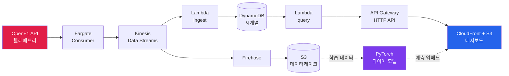

# F1 Real-Time Telemetry Dashboard 🏎️

실시간 F1 텔레메트리 분석 파이프라인 + AI 타이어 전략 예측을 **AWS 서버리스**로 구현한 프로젝트입니다.
OpenF1 데이터를 실시간 스트리밍 아키텍처로 처리하고, PyTorch 타이어 마모 예측 모델을 결합해
레이스 엔지니어링 대시보드로 시각화합니다.

> 🔗 **Live Demo**: CloudFront에 배포된 대시보드 (데모 시에만 배포 — 크레딧 절약을 위해 평소 비활성)
> 📊 **Data**: [OpenF1 API](https://openf1.org) · 2023 싱가포르 GP (session_key 9165)

<!-- 스크린샷 자리: 대시보드 전체 화면 -->
<!--  -->

---

## 핵심 기능

- **실시간 텔레메트리 리플레이** — 트랙맵 위 20대 차량 주행, 팀 컬러 구분, 위치 보간으로 부드러운 애니메이션
- **레이스 엔지니어링 대시보드** — 타이밍 타워(순위), 속도/기어/스로틀/브레이크 게이지, DRS 활성 표시
- **AI 타이어 마모 예측** — PyTorch 회귀 모델이 컴파운드·타이어 나이 기반으로 랩타임 예측 + 마모율 + 피트 전략
- **연도별 규정 대응** — 2026 규정 개편(DRS 폐지 → Active Aero + Overtake Mode)을 연도 파라미터로 자동 분기
- **완전 서버리스 파이프라인** — 수집→스트리밍→저장→서빙 전 구간 관리형 서비스

---

## 아키텍처



**데이터 흐름**: OpenF1 → Kinesis(실시간 버퍼) → 두 갈래로 분기
- **분석 경로**: Firehose → S3 데이터레이크 → PyTorch 모델 학습
- **서빙 경로**: Lambda → DynamoDB → API Gateway → CloudFront 대시보드

---

## 기술 스택

| 영역 | 기술 |
|---|---|
| **스트리밍/수집** | Kinesis Data Streams, Data Firehose, ECS Fargate |
| **저장** | DynamoDB (시계열, PK/SK 키 모델), S3 (데이터레이크) |
| **서빙** | Lambda, API Gateway (HTTP API), CloudFront |
| **ML** | PyTorch (MLP 회귀, 타이어 마모 예측) |
| **IaC** | Terraform + AWS CLI 보완 |
| **프론트엔드** | HTML5 Canvas, Vanilla JS |
| **데이터** | OpenF1 API |

---

## ML: 타이어 마모 예측 모델

`laps`(랩타임) + `stints`(컴파운드·타이어 나이)를 조인해 학습 데이터셋을 만들고,
PyTorch MLP로 **절대 랩타임을 예측**합니다. 같은 모델에 타이어 나이를 1랩씩 굴려
**마모율**과 **피트 전략**까지 도출합니다.

<!-- 스크린샷 자리: tyre_curve.png (마모 곡선) -->
<!--  -->

**검증된 결과** (2023 싱가포르, 457개 랩 데이터):
- 마모 곡선이 실제 타이어 물리와 일치 — U자 형태(워밍업 후 마모), `SOFT < MEDIUM < HARD` 순 랩타임
- 테스트 RMSE ~3.3초 (트렌드 학습 목적엔 충분, 데이터 확장 시 개선 여지)

---

## 실행 방법

### 로컬 프로토타입 (AWS 불필요)

```bash
pip install -r requirements.txt

python build_replay_full.py    # 리플레이 데이터 생성
# dashboard_full.html 을 브라우저로 열기

python build_ml_dataset.py     # ML 데이터셋 생성
python train_tyre_model.py     # 모델 학습 → tyre_model.pt, tyre_curve.png
python predict_strategy.py     # 전략 예측
```

### AWS 배포 (CloudShell)

```bash
bash scripts/00_setup_cloudshell.sh   # 환경 준비 (terraform 설치 등)
bash scripts/deploy.sh                # 인프라 배포 (terraform + CLI 보완)
bash scripts/load_data.sh             # 데이터 적재
# 브라우저에서 CloudFront URL 접속

bash scripts/destroy.sh               # 정리 (크레딧 절약)
```

자세한 배포 절차는 [`scripts/README.md`](scripts/README.md) 참조.

---

## 엔지니어링 하이라이트

### 제약 환경(학교 AWS 계정)에서의 문제 해결

`SafePowerUser` 정책의 강한 제약 하에서 배포를 완성했습니다. Terraform만으로 막히는
부분을 CLI로 보완하는 하이브리드 전략을 사용했습니다.

| 제약 (explicit deny) | 해결 |
|---|---|
| 리소스 태그 읽기/쓰기 | provider `ignore_tags` + `default_tags` 제거 |
| DynamoDB TTL, Kinesis retention | 해당 설정 블록 제거 |
| `lambda:CreateEventSourceMapping` | 컨슈머가 DynamoDB 직접 적재로 우회 |
| IAM Role 생성/PassRole | 관리자 사전 생성 Role ARN 참조 |
| 리소스 네임스페이스 격리 | 전 리소스 `inhatc-202647019-` prefix |

### 실데이터 처리에서 해결한 이슈

- **노이즈 필터링** — 차고/정지 구간(speed=0, x=0) 제거로 데이터 품질 확보
- **타임스탬프 정합** — car_data와 location의 샘플링 주기 차이를 근접 조인으로 매칭
- **DRS 구간 파악** — DRS는 레이스 후반·특정 직선에서만 활성(2023 싱가포르 = 3존)임을 데이터로 검증
- **위치 보간** — 3.7Hz 원본을 화면 60fps로 부드럽게 보간

---

## 프로젝트 구조

```
├── infra/                  # Terraform (KDS, DynamoDB, S3, Lambda, API GW, CloudFront)
├── lambda_src/             # Lambda 핸들러 (ingest: KDS→DynamoDB, query: DynamoDB→대시보드)
├── scripts/                # 배포 자동화 (deploy/load/destroy/setup)
├── openf1_client.py        # OpenF1 API 클라이언트
├── telemetry.py            # 정규화 + 노이즈 필터
├── consumer.py             # Fargate 컨슈머 (LocalSink / KinesisSink)
├── build_replay_full.py    # 리플레이 데이터 빌더 (+ ML 예측 임베드)
├── dashboard_full.html     # 레이스 엔지니어링 대시보드
├── api_loader.js           # 대시보드 API 데이터 로더
├── build_ml_dataset.py     # ML 데이터셋 (laps + stints 조인)
├── train_tyre_model.py     # PyTorch 타이어 마모 모델 학습
└── predict_strategy.py     # 절대 랩타임 + 마모율 + 피트 전략
```

---

## 향후 계획

- [ ] 여러 세션(2023~2026) 데이터 확장 — 연도별 규정 자동 대응 이미 구현
- [ ] 연도별 ML 모델 재학습 (타이어 규정 변화 반영)
- [ ] SageMaker 추론 엔드포인트 — AI 패널을 실시간 클라우드 추론으로
- [ ] Glue + Athena — 데이터레이크 Parquet 변환 + SQL 분석
- [ ] 실시간 라이브 — OpenF1 실시간 구독 + 그랑프리 주말 연동

---

## 참고

- 데이터: [OpenF1 API](https://openf1.org) (2023년~ 무료 제공)
- 2023 싱가포르 GP: 마리나베이 시가지 서킷, 62랩, DRS 3존 (4번째 존은 2024년 추가)