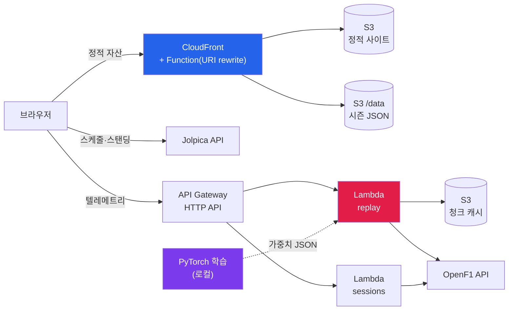

# F1 Telemetry Dashboard 🏎️

F1 텔레메트리를 실시간 리플레이로 재구성하고, PyTorch 타이어 마모 모델의 예측을 함께 보여주는
**서버리스 웹 대시보드**입니다. 스케줄·챔피언십·레이스 결과까지 포함한 종합 대시보드로 확장했습니다.

> 🔗 **Live**: https://d3shcg6j0sntam.cloudfront.net
> 📦 **프론트엔드 레포**: [f1-hub](https://github.com/F3ZLoV/f1-hub) · **이 레포**: 인프라 · Lambda · ML

<!-- 스크린샷: docs/replay.png (리플레이 화면), docs/results.png (결과 페이지) -->

---

## 아키텍처



**세 갈래로 나뉩니다.**

정적 사이트와 시즌 데이터는 **CloudFront에서 바로** 나갑니다. 서버를 거치지 않아 가장 빠릅니다.

스케줄·스탠딩은 **브라우저가 Jolpica를 직접** 호출합니다. 항상 최신이고 Lambda 호출도 늘지 않습니다.

텔레메트리만 **Lambda를 거칩니다.** OpenF1 원본을 그대로 쓸 수 없어 병합·다운샘플링이 필요하고,
그 결과를 S3에 캐시해 두 번째 요청부터는 즉시 반환합니다.

---

## 리플레이가 하는 일

OpenF1은 좌표(`location`)와 텔레메트리(`car_data`)를 **따로, 다른 주기로** 줍니다.
그대로는 "이 순간 이 차가 어디서 몇 km/h였는지"를 알 수 없습니다. Lambda가 이 간극을 메웁니다.

| 처리 | 내용 |
|---|---|
| 노이즈 제거 | 차고·정지 구간(speed·rpm·throttle 전부 0, 좌표 0,0) 폐기 |
| 시간축 근접 조인 | 좌표 시각마다 가장 가까운 텔레메트리를 이진탐색으로 매칭 |
| 랩·스틴트 매핑 | 랩 시작 시각으로 랩 번호를, 스틴트로 컴파운드·타이어 나이를 부여 |
| 다운샘플링 | 3.7Hz 원본을 1~2Hz로 (풀 세션은 1Hz) |
| 컬럼형 직렬화 | 프레임마다 키를 반복하는 대신 축별 배열 + 컴파운드 정수 코드 |

**풀 세션은 청크로 쪼개 점진 로딩합니다.** 2시간 레이스면 좌표만 50만 건이라 한 번에 못 받습니다.
5분 단위로 나눠 첫 조각이 오면 바로 재생을 시작하고, 나머지는 3개씩 병렬로 받아 이어붙입니다.
체감 대기가 40초에서 5초로 줄었습니다.

---

## 트랙 구조 분석

서킷 지도는 **주행 좌표에서 계산**합니다. OpenF1은 코너 번호도 DRS 존 좌표도 주지 않습니다.

- **코너 / 직선** — 경로를 등간격 리샘플 후 진행 방향 변화량(곡률)으로 판정.
  누적 회전각이 작은 굴곡은 걸러내고, 붙어 있는 후보는 한 코너로 병합
- **DRS 존** — 실제로 DRS가 활성된 지점들을 경로에 투영해 군집 탐색.
  드라이버별 편차로 갈라진 조각은 병합, 600m 미만은 노이즈로 폐기
- **섹터 경계** — 랩의 섹터별 소요시간을 절대 시각으로 환산해 그 순간의 좌표를 역산 (정확값)
- **디텍션 포인트** — 어느 API에도 없어 존 시작점 기준 추정. 화면에도 "추정"으로 표기

**2026 규정 대응.** DRS가 폐지되고 액티브 에어로로 바뀌었는데, OpenF1은 2026 세션의 `drs`를
전부 `null`로 줍니다. 활성 여부를 알 수 없으므로 켜짐/꺼짐을 표시하지 않고
"활성 데이터 미제공"으로 명시한 뒤 주요 직선만 참고 표시합니다.

---

## ML: 타이어 마모 예측

`laps`(랩타임)와 `stints`(컴파운드·타이어 나이)를 조인해 학습 데이터를 만들고,
PyTorch MLP(5→32→16→1)로 **예상 랩타임**을 회귀합니다.
같은 모델에 타이어 나이를 1랩씩 굴리면 그 차이가 곧 마모율입니다.

**학습은 파이썬, 추론은 서버리스.** Lambda에 PyTorch를 올리면 패키지가 수백 MB가 됩니다.
모델이 작다는 점을 이용해 **가중치를 JSON으로 내보내고 forward pass만 순수 파이썬으로 구현**했습니다.
의존성이 없어 Lambda 레이어가 필요 없고 zip이 수십 KB입니다.

```
train_tyre_model.py  →  tyre_model.pt
export_tyre_model.py →  tyre_model.json  →  Lambda 추론
```

검증: 마모 곡선이 실제 타이어 거동과 일치(워밍업 후 마모하는 U자형),
컴파운드 순서 `SOFT < MEDIUM < HARD`, 테스트 RMSE 약 3.3초.

⚠️ **한계** — 2023 싱가포르 데이터로만 학습해서 다른 서킷·연도의 절대 랩타임은 맞지 않습니다.
마모 *경향*의 참고값으로만 유효하며, 연도·서킷별 재학습이 다음 과제입니다.

---

## 주요 설계 결정

**정적 데이터를 DB가 아니라 CDN에 둔 이유.**
시즌 결과·예선은 모든 사용자에게 동일한 읽기 전용 데이터이고 과거 시즌은 영원히 불변입니다.
DynamoDB에 넣으면 `브라우저 → API Gateway → Lambda → DynamoDB` 3홉에 콜드스타트까지 붙습니다.
S3에 구워 CloudFront로 내보내면 엣지 캐시에서 한 홉에 끝납니다.
Jolpica의 `limit` 상한이 100이라 시즌 전체(480행)를 한 번에 못 받는 문제도,
오프라인 스크립트에서 페이지네이션으로 모아 파일 하나로 만들어 해결했습니다.

**Amplify 대신 직접 구성.**
Next.js SSR 호스팅으로 Amplify를 검토했지만 서비스 롤 생성(`iam:CreateRole`)이 막혀 있었습니다.
우회하는 대신 **정적 export + 직접 만든 API**로 되돌렸고, 결과적으로 더 나았습니다.
Amplify는 S3·CloudFront·Lambda를 대신 만들어 주는 대신 구조를 블랙박스로 감춥니다.
지금은 각 조각이 왜 거기 있는지 설명할 수 있고, Lambda 캐시 휘발 문제도 S3 캐시로 구조적으로 해결됩니다.

**CloudFront Function이 필요한 이유.**
S3를 OAC로 붙이면 CloudFront는 루트에만 `index.html`을 붙입니다.
`/schedule/` 같은 하위 경로는 404가 나므로, 뷰어 요청 시점에 URI를 다시 씁니다.

---

## 성능

| 항목 | 수치 |
|---|---|
| 리플레이 청크 (5분·2Hz, gzip) | 72 KB |
| 캐시 미스 (OpenF1에서 빌드) | 9.1초 |
| 캐시 히트 (S3) | **0.21초** |
| 시즌 결과 JSON (24전 전체, gzip) | 약 20 KB |
| 풀 세션 첫 재생까지 | 약 5초 (이후 배경 로딩) |

---

## 구성

```
F1RealTimeDashboard/          ← 이 레포: 인프라 · Lambda · ML
├── infra/                    Terraform (API GW, CloudFront, S3, DynamoDB)
├── lambda_src/
│   ├── replay/               청크 빌더 + 타이어 모델 추론 (의존성 없음)
│   ├── sessions/             그랑프리·세션 목록
│   └── ingest/ query/        초기 KDS 파이프라인용 (현재 미사용)
├── scripts/
│   ├── 00_setup_cloudshell.sh   CloudShell 환경 복구
│   ├── deploy.sh                인프라 배포 (terraform + CLI 보완)
│   ├── deploy_frontend.sh       out/ → S3 + CloudFront 무효화
│   ├── build_data_cache.py      Jolpica → S3 시즌 JSON
│   └── destroy.sh               정리
├── train_tyre_model.py       PyTorch 학습
├── export_tyre_model.py      가중치 → JSON
└── predict_strategy.py       마모율 · 피트 윈도우 시뮬레이션

f1-hub/                       ← 프론트엔드 레포 (Next.js 정적 export)
```

---

## 배포

```bash
# 1) 인프라 (CloudShell)
bash scripts/00_setup_cloudshell.sh
export PATH=/tmp:$PATH && export TF_PLUGIN_CACHE_DIR=/tmp/tfcache
cd infra && terraform init && terraform apply
terraform output replay_api_base       # 프론트 빌드에 필요

# 2) Lambda (Terraform이 상태 조회에서 막혀 CLI로 관리 — 아래 제약 참고)
cd lambda_src/replay && zip -qr /tmp/replay.zip . && cd -
aws lambda update-function-code --function-name inhatc-202647019-replay \
  --zip-file fileb:///tmp/replay.zip

# 3) 시즌 데이터 캐시
python3 scripts/build_data_cache.py

# 4) 프론트 (로컬에서 빌드 → CloudShell 업로드)
#    f1-hub: .env.local 에 NEXT_PUBLIC_API_BASE 설정 후 npm run build
bash scripts/deploy_frontend.sh ~/out
```

---

## 제약 환경에서의 문제 해결

학교 AWS 계정은 `SafePowerUser` · `ControlOnlyOwnResources` 정책으로 강하게 제한됩니다.
Terraform만으로 배포가 완결되지 않아, **핵심은 Terraform, 막히는 부분은 CLI로 보완**하는
하이브리드 전략을 썼습니다.

| 제한 (explicit deny) | 영향 | 대응 |
|---|---|---|
| `iam:CreateRole`, `PassRole` | Amplify 사용 불가 | 정적 export + 직접 만든 API로 전환 |
| `lambda:GetFunction` | 생성은 되지만 TF가 상태 확인 실패 | Lambda를 TF 상태에서 제외하고 CLI로 관리 |
| 리소스 태그 읽기/쓰기 | apply 중단 | provider `ignore_tags`, `default_tags` 제거 |
| `dynamodb:UpdateTimeToLive` | TTL 설정 실패 | 해당 블록 제거 |
| `kinesis:IncreaseStreamRetentionPeriod` | 스트림 생성 후 실패 처리 | KDS를 TF 상태에서 제외 |
| `lambda:CreateEventSourceMapping` | KDS→Lambda 자동 트리거 불가 | 컨슈머가 DynamoDB 직접 적재 |
| `SNS:DeleteTopic`, `cloudfront:DeleteDistribution` | destroy 시 일부 잔존 | 관리자 정리 요청 (트래픽 0이면 과금 0) |

---

## 실데이터에서 마주친 문제

**DRS가 안 보이던 문제** — 조회 구간에 DRS 활성 데이터가 아예 없었습니다.
싱가포르는 세이프티카가 잦아 레이스 후반에야 DRS가 켜지는데, 초반 구간만 보고 있었습니다.

**좌표와 텔레메트리의 시각이 어긋남** — 두 엔드포인트의 샘플링 주기가 달라 정확히 일치하는
타임스탬프가 거의 없습니다. 근접 조인으로 해결했습니다.

**Jolpica의 100행 제한** — 시즌 결과를 요청하면 5경기분만 돌아왔습니다.
오프라인에서 오프셋 페이지네이션으로 모아 캐시했습니다.

**국기가 Windows에서 코드로 표시됨** — 이모지 국기를 Windows가 렌더하지 않아
`🇦🇺` 대신 `AU`가 보였습니다. 이미지 CDN으로 교체해 OS 무관하게 만들었습니다.

---

## 향후

- [ ] FastF1의 `circuit_info`로 FIA 공식 코너 번호 적용 (현재는 곡률 기반 추정)
- [ ] 연습주행(P1~P3) 결과 — OpenF1 세션 랩타임 집계 필요
- [ ] 연도·서킷별 타이어 모델 재학습
- [ ] 실시간 (OpenF1 구독 + MQTT) — 이때 KDS 파이프라인이 제 역할을 함
- [ ] 2021~2022 텔레메트리 — OpenF1 미제공, FastF1 사전 빌드 필요

---

## 데이터 출처

- [OpenF1](https://openf1.org) — 텔레메트리·좌표·세션 (2023~)
- [Jolpica-F1](https://api.jolpi.ca/ergast/f1) — 스케줄·스탠딩·결과 (Ergast 후속, 1950~)
